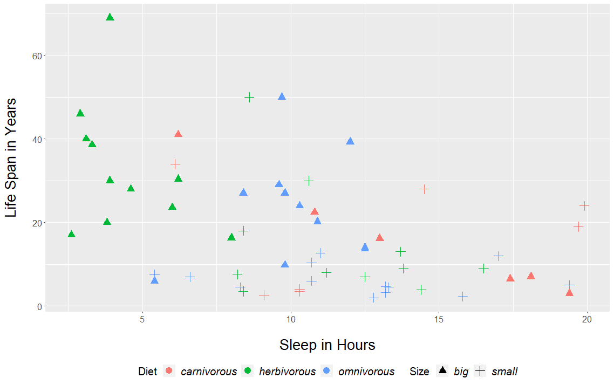

# Correlation analysis with Kendall's tau: An example

## Motivation

During the research for a statistics lecture, I came a across the thread [Pearson's or Spearman's correlation with non-normal data](https://stats.stackexchange.com/questions/3730/pearsons-or-spearmans-correlation-with-non-normal-data). Multiple comments address Kendall's Tau, which is a nonparametric measure of rank correlation with supposedly desireable properties. 
Since I never heard of this measure before, I decided to play around with a simple data set and use Kendall's tau as a measure of association:

But before examining this data set further, I'll introduce the basics of Kendall's tau.

## Kendall's tau basics

Tau is a nonparametric measure of association introduced by Maurice G. Kendall in *Rank correlation methods* (You can find this book (here)[https://archive.org/details/rankcorrelationm0000kend/mode/2up] for free. It is easy to read).
As a nonparametric measure **inferences** require, in contrast to Pearson’s coefficient, no assumption regarding the bivariate distribution. Also, Kendall's tau is more intuitive and easier to interpret than Spearman's rho. 

